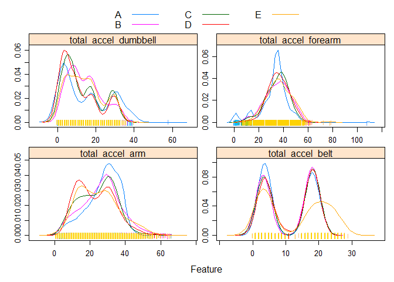
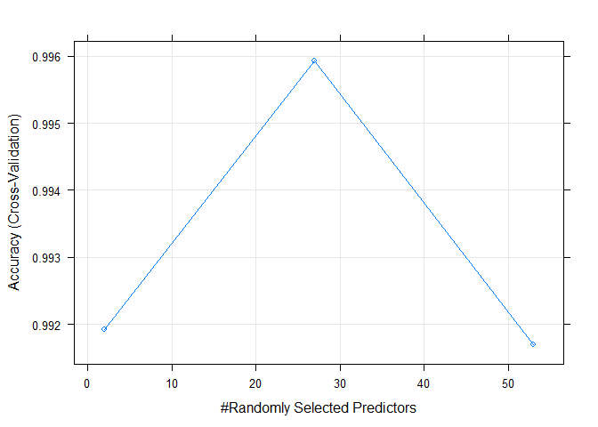

# Practical Machine Learning
Alfred Aita  
November 14, 2015  
# Predicting Excersise Quality  

## Mission and Motivation

 The main focus of this project is to build a Machine learning model which will predict the quality of the weight lifting exercise being performed by 6 participants,wearing digital sensors designed to measure their activity (accelerometers).The exercise performance is qualified as: (A,B,C,D,E).
 
 Our data sources for training and testing are Downloaded  at:
 
 https://d396qusza40orc.cloudfront.net/predmachlearn/pml-training.csv  
 
 https://d396qusza40orc.cloudfront.net/predmachlearn/pml-testing.csv

Thanks to groupware for sharing the data and supporting documentation 

http://groupware.les.inf.puc-rio.br/har

# Dats Process and first steps

>- After downloading the two data sets  are loaded and a first exploratory review is performed.
>- Our examination begins and we note their are 159 potential predictors and one outcome: 'classe'.
>- We note some variables contain many NAs and not needed. We eliminate those
>- Additional data process steps are performed and we are able to reduce  to 53 predictors.
>- We further examine our data with some exploritory Data analysis.
>- Using the caret package, we  split the training set into two sets training and testing.
>- We now build the model for classification using random forest with cross-validation.
>- The model is trained and summary information and a confusion table are examined. 
>- Predictions are made using the model on the out Of Sample test set (OOS)
>- OOS Accuracy and estimated error rates calculated.
>- The  model is then applied to our downloaded test data for answering questions.
>- Final thoughts on the project
>- Predictions are written to a text file for the write up.


```r
Rawtraining <-read.csv("pml-training.csv", na.strings = c("NA", ""))
Rawtesting<-read.csv("pml-testing.csv",na.strings = c("NA","")) 
dim(Rawtraining);dim(Rawtesting)
```

```
## [1] 19622   160
```

```
## [1]  20 160
```

we can see that there are probably too many variables,next we will eliminate the Na for both sets by 
column and again examine our dimension. The goal is to cut down on variables but not observations.  


```r
# ID the column with too many NAs
NAs<- apply(Rawtraining,2,function(x){sum(is.na(x))})
# new data set
Rawtraining <- Rawtraining[,which(NAs==0)] # purge them

NAs<- apply(Rawtesting,2,function(x){sum(is.na(x))})
Rawtesting <- Rawtesting[,which(NAs==0)] 
dim(Rawtraining);dim(Rawtesting)
```

```
## [1] 19622    60
```

```
## [1] 20 60
```
Lets take a look at what else we can eliminate. We only need to examine the first few. 


```r
str(list(head(Rawtraining,4)),list.len = 8)
```

```
## List of 1
##  $ :'data.frame':	4 obs. of  60 variables:
##   ..$ X                   : int [1:4] 1 2 3 4
##   ..$ user_name           : Factor w/ 6 levels "adelmo","carlitos",..: 2 2 2 2
##   ..$ raw_timestamp_part_1: int [1:4] 1323084231 1323084231 1323084231 1323084232
##   ..$ raw_timestamp_part_2: int [1:4] 788290 808298 820366 120339
##   ..$ cvtd_timestamp      : Factor w/ 20 levels "02/12/2011 13:32",..: 9 9 9 9
##   ..$ new_window          : Factor w/ 2 levels "no","yes": 1 1 1 1
##   ..$ num_window          : int [1:4] 11 11 11 12
##   ..$ roll_belt           : num [1:4] 1.41 1.41 1.42 1.48
##   .. [list output truncated]
```


By examining the above we can see an additional 6 more variables can be omitted. They probably would add
no predictive advantages.


```r
throwOut<-grep("timestamp|X|user_name|new_window", names(Rawtraining))
TRaining<-Rawtraining[,-throwOut]; TEsting<- Rawtesting[,-throwOut]
dim(TRaining); dim(TEsting)  
```

```
## [1] 19622    54
```

```
## [1] 20 54
```

Now split the training data into testing and training note: **testing** is all small case


```r
library(caret)
```

```
## Loading required package: lattice
## Loading required package: ggplot2
```

```r
set.seed(123) # so we can reproduce 
inTrain<- createDataPartition(y=TRaining$classe,p= 0.7,list = F)
training <- TRaining[inTrain,]; testing <- TRaining[-inTrain,]
dim(training);dim(testing)
```

```
## [1] 13737    54
```

```
## [1] 5885   54
```

there are several variables which are totals of the others lets plot them for some insight


```r
Accel<- grep("total",names(training))
  #AccelFrame<- training[,Accel]
  #transparentTheme(trans = .9)
featurePlot(x=training[,Accel],
            y=training$classe,  
            plot = "density",
            scales = list(x=list(relation = "free"),
                          y= list(relation = "free")),
                          adjust = 1.5,pch ="|", layout =c(2,2),
                          auto.key =list(columns = 3))
```

 
 
# Machine learning algorythm

Now build a classification model, random forest with cross validation. The model take quite sometime to run so we will cache it.


```r
#A train control function is created to set up cross validation
Fitcontrol<- trainControl(method = "cv",number = 3)

# training the model
Rf.model<- train(training$classe ~., method= "rf",trControl = Fitcontrol,data = training)
```

```
## Loading required package: randomForest
## randomForest 4.6-12
## Type rfNews() to see new features/changes/bug fixes.
```

```r
summary(Rf.model)
```

```
##                 Length Class      Mode     
## call                4  -none-     call     
## type                1  -none-     character
## predicted       13737  factor     numeric  
## err.rate         3000  -none-     numeric  
## confusion          30  -none-     numeric  
## votes           68685  matrix     numeric  
## oob.times       13737  -none-     numeric  
## classes             5  -none-     character
## importance         53  -none-     numeric  
## importanceSD        0  -none-     NULL     
## localImportance     0  -none-     NULL     
## proximity           0  -none-     NULL     
## ntree               1  -none-     numeric  
## mtry                1  -none-     numeric  
## forest             14  -none-     list     
## y               13737  factor     numeric  
## test                0  -none-     NULL     
## inbag               0  -none-     NULL     
## xNames             53  -none-     character
## problemType         1  -none-     character
## tuneValue           1  data.frame list     
## obsLevels           5  -none-     character
```


## Results from the trained model  

Now look at models stats and a confusion matrix 


```r
Rf.model; Rf.model$finalModel$confusion 
```

```
## Random Forest 
## 
## 13737 samples
##    53 predictor
##     5 classes: 'A', 'B', 'C', 'D', 'E' 
## 
## No pre-processing
## Resampling: Cross-Validated (3 fold) 
## Summary of sample sizes: 9158, 9159, 9157 
## Resampling results across tuning parameters:
## 
##   mtry  Accuracy   Kappa      Accuracy SD  Kappa SD   
##    2    0.9919198  0.9897783  0.002082027  0.002633623
##   27    0.9959236  0.9948436  0.002186778  0.002766205
##   53    0.9917016  0.9895024  0.002655005  0.003359977
## 
## Accuracy was used to select the optimal model using  the largest value.
## The final value used for the model was mtry = 27.
```

```
##      A    B    C    D    E  class.error
## A 3904    1    0    0    1 0.0005120328
## B    6 2648    4    0    0 0.0037622272
## C    0    3 2393    0    0 0.0012520868
## D    0    0    9 2243    0 0.0039964476
## E    0    0    0    6 2519 0.0023762376
```

Our test data has been processed so lets predict. Recall this set is named **TEsting** 
 Applying our machine learning model to get predictions.

```r
  prediction <- predict(Rf.model,newdata = TEsting)

prediction;  print('prediction summary'); summary(prediction)
```

```
##  [1] B A B A A E D B A A B C B A E E A B B B
## Levels: A B C D E
```

```
## [1] "prediction summary"
```

```
## A B C D E 
## 7 8 1 1 3
```


 We will now examine some charts of our model. Lets look at accuracy compared to the number of predictors (log)

Our plot confirms that the the best model is the second indicated from above with 27 variables.


```r
plot(Rf.model, log = "y")
```

 

# Out of sample error rate 

Now we will use test set partitioned from our training set.(I.E testing)


```r
predicted <- predict(Rf.model,newdata= testing)
length(predicted)
```

```
## [1] 5885
```

```r
testSetAccuracy <- sum(predicted ==testing$classe )/length(predicted)
round(testSetAccuracy,6)
```

```
## [1] 0.997621
```

```r
OOSerrorRate <-  (1-testSetAccuracy)
OOSerrorRate 
```

```
## [1] 0.002378929
```

```r
paste0("The out of sample error rate estimate is",round((OOSerrorRate *100),2),"%")
```

```
## [1] "The out of sample error rate estimate is0.24%"
```

## Final thought
 More times then not our out of sample error would be higher, this model however, did slightly better.
 Although by an insignificant amount.
 Why? The luck of the seed perhaps.
 
## Capture file for write up


```r
write_PML = function(x){
       n =length(x)  
       for(i in 1:n){
         filename = paste0("problem_id_", i, ".txt")
         write.table(x[i], file = filename, quote = FALSE, row.names = FALSE, 
            col.names = FALSE)}
}
write_PML(prediction)
```
